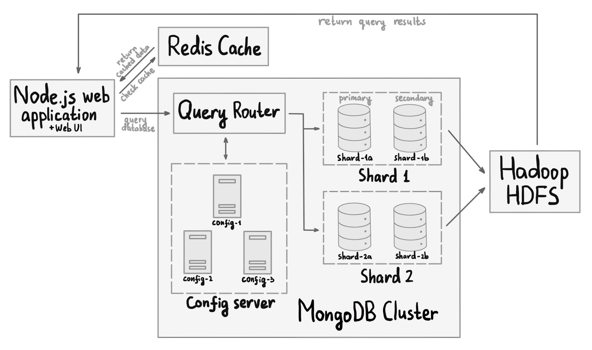

# Distributed Data Center 💾 

### Project overview
This project implements a data center in a distributed context. Data to be managed and processed include structured data (5 relational tables – `User`, `Article`, `Read`, `Be-Read` and `Popular-Rank`), and unstructured data (text, images and videos).

The system is deployed using __Docker__ for containerization, __MongoDB__ (as a sharded cluster) for structured data, __Hadoop HDFS__ for unstructured data, and __Redis__ for in-memory caching. Web application, built using __Node.js__, queries MongoDB cluster through the Router. Redis caches frequently accessed data to reduce MongoDB load.  

### Architecture diagram

 

Available functionality:
- Bulk load – one time mass insert into User, Article, and Read tables, construction of Be-Read and Popular-Rank tables
- Query execution – insert, update read statistics, top-5 popular articles
- Monitoring – running status, operations overview, resource memory usage, data distribution
- Advanced features – expansion allowing a new DBMS server to join; dropping a DBMS server at will

 

Folders structure:
- [`data-generation`](./data-generation) – samples and scripts for generating data
- [`frontend`](./frontend) – web application serving as a single entry point; it starts the server and handles HTTP requests, including managing queries
- [`scripts`](./scripts) – JavaScript files for initializing tables

 

### Manual
First time initialization  
`chmod +x init.sh` (to make init.sh script executable)  
`./init.sh` (automates data center setup)

To start the data center for subsequent launches  
`docker compose up`  
To start the web application  
`docker compose up frontend`

Accessing the Web UI  
`http://localhost:3000` – web application  
`http://localhost:9870` – Hadoop

The data center can also be connected to and managed using __MongoDB Compass__. To connect, create a new connection and use the following URI: `mongodb://localhost:27100/`.